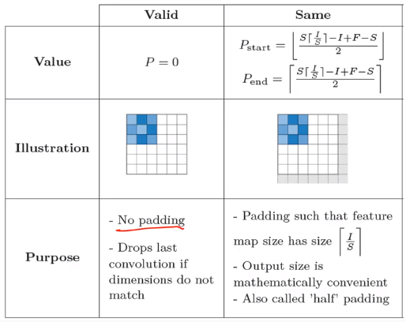

# CNN(Convolutional Neural Network)

## 1. CNN

- CNN은 합성곱 계층(Convolutional Layer), 풀링 계층(Pooling Layer), Fully Connected로 구성되어 있다.
  - Convolution, Pooling layer - feature extraction
  - Fully-connected layer - classfication
- 이미지 분류에서 가장 많이 사용된다.

## Convolution이란?

- 이미지 위에서 stride 값 만큼 filter(kernel)을 이동시키면서 겹쳐지는 부분의 각 원소의 값을 곱해서 모두 더한 값을 출력으로 하는 연산

- convolution filter의 개수 == output feature map의 channel

  input channel = filter의 channel

### Options of covolution

- Stride

  : How far to go to the right or the bottom to perform the next convolution

- Zero padding

  : 패딩을 안하고 convolution 연산을 하면 이미지가 줄어들게 되어 layer를 깊게 쌓는데 지장이 생긴다. 이를 막기 위해 주변에 0으로 layer한다.

  stride=1 인 convolution layer와 F x F 사이즈의 filter, zero-padding (F-1/2) 가 많이 사용

### Activation Function

- ReLU

  : 음수 => 0, 양수 => 양수 그대로

### tf.keras.layers.Conv2D

- filters : Integer, the dimensionality of the output space(즉, convolution의 output filters의 수)

- kernel_size: An integer(e.g. 3), or tuple/list(e.g. (3, 3)) of 2 integers, specifying the height and width of the 2D convollution window. Can be a single integer to specify the same value for all spatial dimensions
- strides: An integer or tuple/list of 2 integers, specifying the strides of the convolution along the height andn width. Can be a single integer to specify the same value for all spatial dimensions. Specifying any stride value != 1 is incompatible with specifying andy `dilation_rate` value != 1.
- padding: one of "valid" or "same"(case-insensitive)
- data_format: A string, one of `channels_last`(default) or `channels_first`. The ordering of the dimensions in the inputs. `channels_last` corresponds to inputs with shape `(batch, height, width, channels)` while `channels_first` corresponds to inputs with shape `(batch, channels, height, width)`. It defaults to the `image_data_format` value found in your Keras config file at `~/.keras/keras.json`. If you never set it, then it will be "channels_last"
- activation
- use_bias
- kernel_initializer
- bias_initializer
- kernel_regularizer: Regularizer function applied to the kernel weights matrix
- bias_regularizer: Regularizer function applied to the bias vector

** kernel dimension: {height, width, in_channel, out_channel}

### Padding

s: stride i:  f: filter의 가로 세로 사이즈