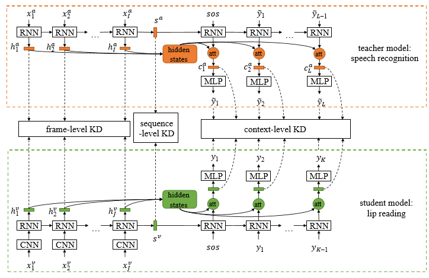

## Hearing Lips: Improving Lip Reading by Distilling Speech Recognizers | 200407

- 비디오에서의 입술 움직임을 식별 가능한 특징 추출하는 것을 어렵게 하는 작동의 모호한 특성으로 성능이 낮았음

- Speech recognizers(음성 인식기)를 학습하여 립리딩 강화

  => 음성 인식기에서 추출된 특징이 미묘한 입술 움직임에서 얻기 어려운 부분의 보조적이고 차별적인 단서 제공

  => 해당 단서가 립리딩 훈련을 용이하게 함

- 음성인식기의 다중 입도 지식을 립 리더로 distillation 증류함으로써 달생

- cross-modal knowledge distillation 을 수행하기 위해 연구자들은 오디오 비디오 간의 일곤성 없는 길이를 처리하기 위해 효과적인 정렬 체계를 사용할 뿐 만 아니라 음성 인식기의 예측 결과를 재정의하기 위해 innovative필터링 전략을 채택

- CMLR 및 LRS2 데이터 세트에서 새로은 SOTA 결과를 달성

- 벤치 마크 방법을 각각 문자 오류율(CER)에서 7.66%  및 2.75%  초과

- 향후 프레임 워크를 음성 및 수화와 같은 다른 다중 모드 쌍에 적용하기를 희망


### Introduction

- video-based lip reading 이 audio-based speech recognition 보다 낮은 해독 능력을 가짐

- 같은 양의 training data와 model architecture  하에서 퍼포먼스 차이는 character error rate 에서 speeche recognition 10.4%, lip reading: 39.5% 정도 난다.(chung et al. 2017)

  => 다른 단어에 대한 입술 움직임이 겉보기에는 동일해 보이는 애매모호한 입술 동작 때문

- pre-trained speech recognizer가 주어졌다고 가정하고, trained될 target lip reader에 speeceh recognizer를 숨겨 knowledge distillation을 시도 

- 미묘한 움직임은, 청각적으로 인식하는게, 시각적으로 구별하는 거보다 편리함

- speech recognizer로 부터 추출한 acoustic speech features를 몹ㅇ함으로써, lip reader의 시각적 특징 판별 추출 성능 향상을 기대할 수 있음

- To this end, LIBS is designed to distill knowledge at multiple temporal scales including sequence-level, context-level, and frame-level, so as to encode the multigranularity semantics from the input sequence. 

- we employ a crossmodalalignmentstrategytosynchronizetheaudioandvideo data by finding the correspondence between them, so as to conduct the fine-grained knowledge distillation from audio features to visual ones. To enhance the speech predictions, ontheotherhand,weintroduceafilteringtechniquetorefine the distilled features, so that useful features can be filtered for knowledge distillation. 


-  It is noteworthy that when the amount of training data shrinks, the proposed approach tends to yield an even greater performance gain. For example, when only 20% of the training samples are used, the performance against the baseline has an 9.63% boost on the CMLR dataset. 


`Knowledge Distillation`

- 학습된 기본 모델을 통해 새로운 모델의 생성 시 파라미터값을 활용하여 학습시간 을 줄이는 연구

- Knowledge distillation 은 미리 학습시킨 Teacher network 의 출력을 내가 실제로 사용하고자 하는 작은 모델인 Student network 가 모방하여 학습함으로써, 상대적으로 적은 Parameter 를 가지고 있더라도 모델의 성능을 높이는 방법론

  ```markdown
   기술은 앙상블(Ensemble) 기법을 통해 학습된 다수의 큰 네트워크들로부터 작은 하나의 네트워크에 지식을 전달할 수 있는 방법론 중의 하나이다. 다수의 큰 네트워크들인 전문가(Experts, Teacher) 모델에 서 출력은 일반적으로 특정 레이블에 대한 하나의 확률값 만을 나타내지만, 이를 확률값들의 분포 형 태로 변형하여, 숙련가(Specialist, Student) 모델 의 학습 시에 모델의 Loss와 전문가 모델의 Loss 를 동시에 반영하는 형태로 숙련가 모델을 학습에 활용한다[(그림 10) 참조]. 일반적인 지식 증류 기술의 연구는 모델 압축 기술과 같이 신경망을 간소화하는 방식으로 이루어 지고 있지만, 반대로 현재 훈련된 네트워크보다 더 큰 네트워크로의 지식 전이(Knowledge Transfer) [15]를 하는 연구도 진행 중이다. 이러한 지식 전이 기법 중에서 더 깊거나 더 넓은 네트워크를 만들 때 정보를 완벽히 동일하게 전달하는 연산(Operation) 방법도 가능하다.
  ```

  

- https://light-tree.tistory.com/196

- https://ettrends.etri.re.kr/ettrends/176/0905176005/34-2_40-50.pdf


## Related Work

- 기존 knowledge ditillation과 다른점은, 기존은 sequence level 이었다면, RNN에 대한 feature-level knowlidge ditillation 함


## Background

- attention based Sequence to Sequence model

- x : 비디오 프레임 시퀀스
- y : 타겟 프레임 시퀀스
- 음성 인식기로 예측된 문장은 불완전함




- basic lip reader는 조건부 확률(즉, 손실함수)을 줄이기 위해 train된다.

- s: sequence vector 

- `비디오오 오디오 프레임 시퀀스 벡터 (sa, sv)는 같은 것을 다르게 표현한 것이기 때문에 같아야만 한다.`

- the sequence-level knowledge distillation is denoted as :

  

   t is a simple transformation function (for example a linear or affine function), which embeds features into a space with the same dimension.


- Context level knowledge distillation
  - even if there are same characters in the predicted sentence, their corresponding context vectors are different because of their different positions.


### Training Stratgy

- CMLR, LRS2 둘다 단어 단위로 주석이 달린게 아니고, 길이에 따른 부분집합으로 그룹화 되어 있음. 따라서 짧은 문장을 시작으로 트레이닝함
- 영어 문장은 적어도 14characters를 가져서, 학습 초반의 모든 input steps에서 디코더


CMLR 

- VGG-M 모델